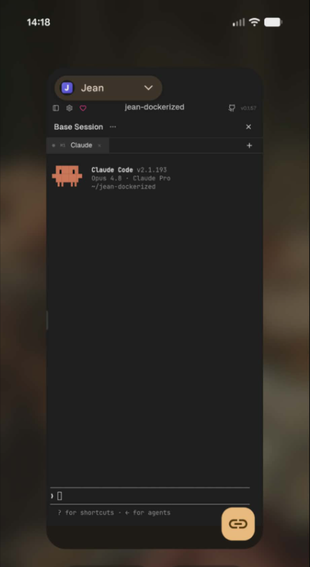
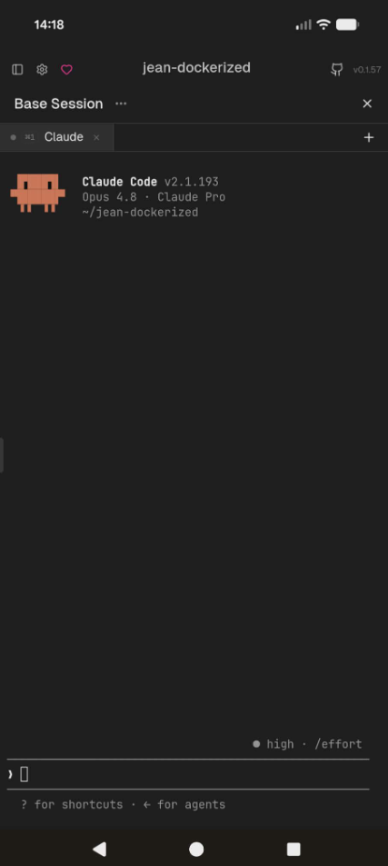
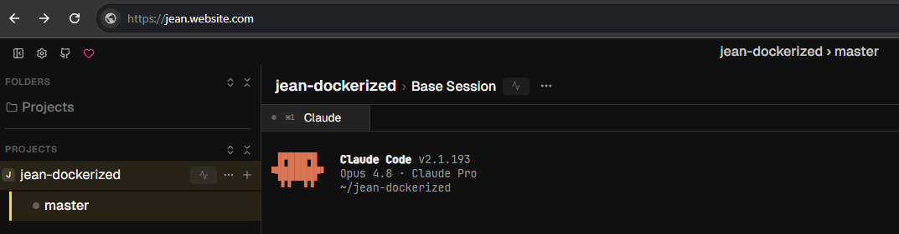
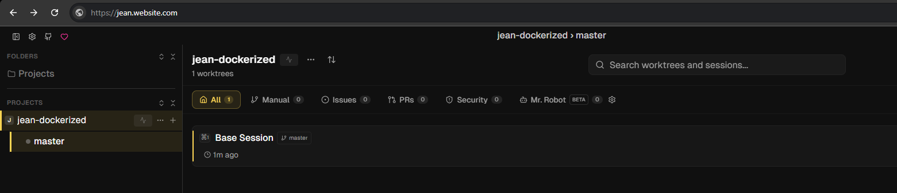
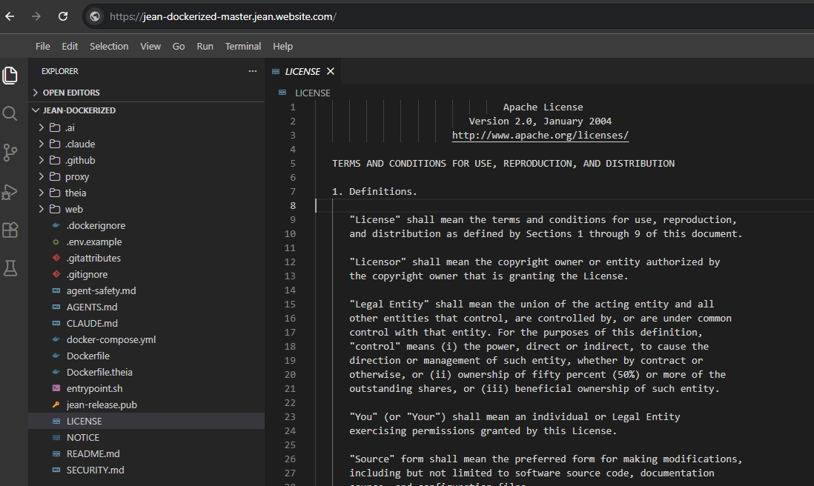
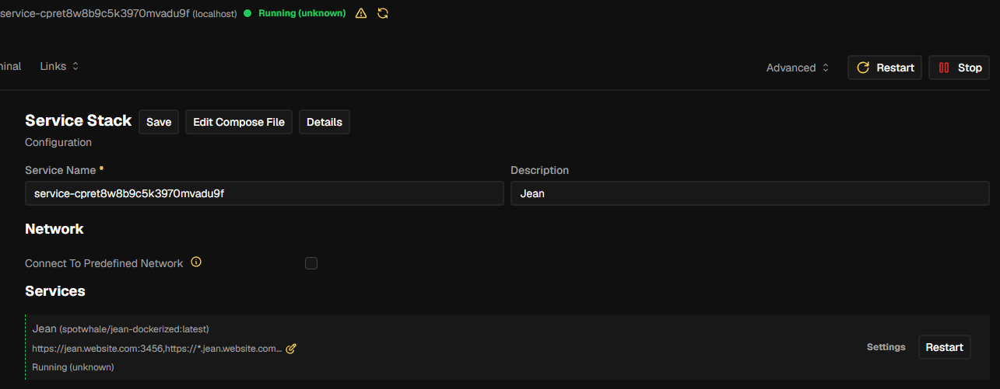

# jean-dockerized

[](https://hub.docker.com/r/spotwhale/jean-dockerized)
[](https://hub.docker.com/r/spotwhale/jean-dockerized)
[](https://github.com/SPOTWHALE/jean-dockerized/releases)
[](https://github.com/SPOTWHALE/jean-dockerized/actions/workflows/release.yml)

Run [Jean](https://github.com/coollabsio/jean) headless on your own server: a full AI coding environment - Claude and Codex agents, a browser IDE, and Docker-in-Docker - reachable from any device with no local setup.

## Features

- **Browser UI** - Jean's full interface served over HTTPS, token-protected
- **Installable PWA** - add it to your phone's home screen and use it like a native app
- **Built-in IDE** - a bundled [Eclipse Theia](https://theia-ide.org/) editor (files, terminal, git, extensions) one tap away, no extra port
- **Notifications** - subscribe your phone so the agent can buzz you when it finishes, errors, or needs approval - fire a task, pocket the phone, get pinged
- **Preview URLs** - dev servers the agent starts are instantly reachable at `<port>.apps.your-domain` (same pattern as Codespaces/Gitpod)
- **Docker-in-Docker** - agents can run `docker` and `docker compose`; requires `privileged: true`
- **No-domain access** - join your [Tailscale](https://tailscale.com/) tailnet and reach it from anywhere by private IP - no domain, SSL, or open ports
- **amd64 + arm64** - one image runs on x86 servers and ARM (Apple Silicon, Ampere/Graviton, Raspberry Pi)
- **Persistent workspace** - repos, credentials, and settings survive redeploys
- **Auto-updates** - watches Jean releases daily and rebuilds automatically

## Screenshots

**Mobile (installable PWA)**

<table>
<tr>
<td></td>
<td></td>
</tr>
</table>

**Web UI &amp; built-in IDE**

<table>
<tr>
<td></td>
<td></td>
</tr>
<tr>
<td></td>
<td></td>
</tr>
</table>

## Deploy on Coolify

1. **New Resource → Docker Compose**, paste [`docker-compose.yml`](./docker-compose.yml)
2. Set the domains to `https://jean.example.com:3456,https://*.jean.example.com:8088`
3. Add two A records in your DNS pointing to your server's IP (e.g. `jean` and `*.jean`)
4. Deploy, open your domain, and enter the token from the logs - or set a fixed one with `JEAN_TOKEN`

<details>
<summary><strong>Previews/IDE return <code>503 no available server</code>?</strong></summary>

Coolify's auto-generated Traefik labels drop the load-balancer port on the **HTTPS
wildcard** service when one container serves two ports (3456 + 8088) plus a wildcard
domain, so the app on `jean.example.com` works but every `*.jean.example.com` 503s.

Fix: **clear the Domains field** in Coolify (so it stops generating the broken labels)
and route by hand with the commented `labels:` block in
[`docker-compose.yml`](./docker-compose.yml) - stable, redeploy-proof names. These are
Traefik-only; other proxies ignore them.

If a proxied host is served by **Cloudflare** (orange cloud), note Universal SSL covers
only `example.com` + `*.example.com` (one level) - a 3-level host like
`*.jean.example.com` needs Total TLS / Advanced Certificate Manager, or grey-cloud the
record so Traefik terminates TLS itself.

</details>

## Run locally

<details>
<summary><strong>Build, run &amp; access a local image</strong></summary>

`docker-compose.yml` references the **published** image (`spotwhale/jean-dockerized:latest`)
and has **no `build:` section**, so `docker compose up` on its own just pulls and runs the
released image - it will **not** include local/branch changes or a Jean version you pick.

**Build & run a local image** - to run a local build you must build that tag yourself first:

```bash
cp .env.example .env            # optional - JEAN_TOKEN / PREVIEW_PASSWORD / JEAN_PUBLIC_URL

# Build the image for a published Jean release tag and name it :latest. The build
# pulls the prebuilt `theia-base` automatically (only build it yourself after
# editing theia/ - see "Common commands" in AGENTS.md).
docker build --build-arg JEAN_REF=v0.1.60 -t spotwhale/jean-dockerized:latest .

docker compose up -d            # runs the image you just built (no re-pull)
docker compose logs -f          # startup banner prints the access token + login link
# open the ?token=... URL from the logs
```

Re-run the `docker build` + `docker compose up -d` after any change under `web/` to pick it up.

**Test from your phone (same wifi)** - edit `docker-compose.yml` before `up`:

- change the app bind `127.0.0.1:3456:3456` → `0.0.0.0:3456:3456` (loopback-only by default
  won't accept LAN connections), and open your host firewall for port `3456`;
- set `JEAN_PUBLIC_URL: http://<your-LAN-ip>:3456` - it prints a scannable QR in the logs and
  enables the IDE button + push.

Then scan the QR (or open `http://<your-LAN-ip>:3456/?token=...`).

> Service workers / PWA install / Web Push need a **secure context**, so over plain
> `http://<ip>` they're off; use `localhost` on the host, or an HTTPS tunnel/domain, for those.
> (Tailscale also serves plain `http`, so those features are off there too.)

**Lost or changed your token?** Open `https://your-domain/token.html?reset` to clear
the saved token, then paste your access token again (from the logs or `JEAN_TOKEN`).
Works inside the installed PWA too. The page only stores the token in your browser; it
grants nothing on its own, since Jean's backend still validates it on every request.

</details>

## Tailscale (no domain)

Don't have a domain yet, or want to run this on a home box / laptop / cheap VPS
and reach it from your phone? Set **`TS_AUTHKEY`** (an
[auth key](https://login.tailscale.com/admin/settings/keys)) and the container
joins your [tailnet](https://tailscale.com/) on boot - no domain, SSL, reverse
proxy, or open ports:

- **Jean UI** → `http://<tailscale-ip>:3456` (the startup banner prints the exact link)
- **Agent dev servers** → `http://<tailscale-ip>:<port>` **directly** (the agent must bind `0.0.0.0`)
- **Built-in IDE** → the `</> IDE` button just works; over Tailscale it routes to the
  worktree's own Theia port instead of a `<slug>.<domain>` subdomain

Install Tailscale on your phone/laptop, sign into the same tailnet, and the
container is reachable by its private IP (or MagicDNS name). The node identity
persists on the workspace volume, so the IP is stable across restarts.

```yaml
environment:
  TS_AUTHKEY: tskey-auth-xxxxx   # from the Tailscale admin console
  TS_HOSTNAME: jean              # optional, defaults to "jean"
```

> Within a tailnet every port on the node is reachable by IP, so the wildcard
> `<port>.<domain>` proxy isn't needed: dev servers, and each per-worktree Theia,
> are reached on their own port directly. **No domain, SSL, or reverse proxy** -
> and **no need to set `JEAN_PUBLIC_URL`**.
>
> **[Notifications](#push-notifications) don't work over Tailscale** - Web Push needs a
> secure context (HTTPS), and `http://<tailscale-ip>` isn't one. For phone
> notifications you need the HTTPS domain path (which can run alongside Tailscale).
>
> **Security:** over Tailscale these direct ports bypass the `PREVIEW_PASSWORD`
> basic-auth gate (which lives in Caddy) - the tailnet itself is the access
> boundary. Each Theia terminal runs as root over all of `/workspace`, so keep
> the tailnet single-user (or ACL it). Use the `</> IDE` button via the **Tailscale
> IP** shown in the banner; a MagicDNS name falls back to the domain/subdomain path.

## Preview URLs

<details>
<summary><strong>Reach an agent's dev server</strong></summary>

When an agent starts a dev server, reach it at `https://<port>.apps.your-domain`
(domain path), or directly at `<tailscale-ip>:<port>` over Tailscale (above).

Setup (Coolify):
1. Wildcard TLS needs a **DNS-01** challenge - add your DNS provider token in Coolify/Traefik
2. The agent must bind to `0.0.0.0`, e.g. `vite --host` or `php artisan serve --host 0.0.0.0 --port 8000`

> Preview subdomains are **disabled (403) until you set `PREVIEW_PASSWORD`**, which gates every preview port behind one basic-auth login (`PREVIEW_USER` defaults to `dev`). This fails closed so a misconfigured deploy never exposes loopback ports to the internet.

</details>

## Push notifications

<details>
<summary><strong>Get a phone notification when an agent finishes</strong></summary>

Agents run long; the point of coding from your phone is to walk away. An
**Agent notifications** toggle in **Settings → General → Notifications**
subscribes this browser to Web Push, so you get a notification when an agent
**finishes a turn**, **errors**, or **needs your approval** - even with the tab
closed or the PWA backgrounded. Tapping the notification reopens Jean.

How it works: a small relay watches Jean's own event stream (no fork) and fans
the interesting events out as Web Push. It is reached through the **same preview
proxy** as previews/IDE, at `https://jdpush.<your-wildcard-domain>`.

Setup:
1. Set **`JEAN_PUBLIC_URL`** (your public host). Push uses subdomains of it
   (`jdpush.<host>`), so this is what **enables** the feature and the `🔔` button;
   it's **disabled** (button hidden) when unset. `JEAN_TOKEN` is optional - if
   unset, the relay uses jean's auto-generated token.
2. Open Jean over **HTTPS** and tap `🔔` to grant permission. On iOS, **add Jean
   to your home screen first** - Safari only allows Web Push from an installed PWA.

> Coverage note: for jean's native (Codex) sessions, "finished" / "errored" /
> "needs approval" fire from chat events. The **Claude backend runs as a terminal
> TUI** (no chat events), so it's covered by **idle detection** - a push when the
> terminal goes quiet (finished or waiting). Tune or disable with `PUSH_IDLE_MS`.

</details>

## Built-in IDE

<details>
<summary><strong>Per-worktree Theia editor</strong></summary>

A full [Eclipse Theia](https://theia-ide.org/) editor (file tree, integrated
terminal, git, search, and Open VSX extensions) ships inside the image. A floating
**`</> IDE`** button in Jean's web UI opens it in a new tab.

The IDE is **scoped per git worktree**: a dispatcher lazily runs one Theia per
repo/branch worktree (rooted at that directory, idle-reaped) and routes by hostname
through the **same preview proxy** as dev servers - never on its own host port:

- `https://ide.<your-wildcard-domain>` - a picker listing every repo › branch worktree under `/workspace`
- `https://<repo>-<branch>.<your-wildcard-domain>` - that worktree's scoped editor

The `</> IDE` button reads Jean's active repo/branch and opens that worktree directly,
falling back to the picker when nothing is open.

Setup (domain path):
1. It is gated by the preview proxy, so it is **only reachable once `PREVIEW_PASSWORD`
   is set** (same basic-auth login as previews; fails closed otherwise).
2. Set `JEAN_PUBLIC_URL` - the IDE wildcard is subdomains of its host, derived
   automatically so the button builds correct links. Unset falls back to
   `.<current-host>`.

> On the **[Tailscale](#tailscale-no-domain) path neither is needed** - set `TS_AUTHKEY`
> and the button routes to the worktree's own Theia port directly (no wildcard, no
> `PREVIEW_PASSWORD` gate; the tailnet is the access boundary).

> **Cosmetic scoping, not a security boundary.** Each Theia only roots the sidebar at
> one worktree; its integrated terminal still runs as root and can reach all of
> `/workspace`. Real isolation needs a container per repo. Theia shares `/workspace`
> with Jean and the agents, and its settings persist on the volume (`HOME=/workspace`).

</details>

## Security

<details>
<summary><strong>Hardening checklist</strong></summary>

- Always access through HTTPS. Never expose port `3456` directly.
- One container per person: it holds live AI credentials and git push access.
- **Runs `privileged`** (required for Docker-in-Docker): the container has host-level access. Treat it as trusted, single-tenant. Do **not** pack multiple users' containers onto one shared host; a privileged container can escape to the host and reach every other container on it.
- Jean's web UI is token-protected; preview ports can be gated with `PREVIEW_PASSWORD`.
- The build verifies Jean's release `.deb` against its signing key (minisign) before baking it into the image, so a tampered release asset can't reach your credentials.

</details>

<details>
<summary><strong>Multi-tenant / untrusted use</strong></summary>

`privileged` is unsafe when many people share one host. To run a container per tenant safely, drop `privileged` and use a host runtime that gives Docker-in-Docker with real isolation:

- **[Sysbox](https://github.com/nestybox/sysbox)**: install `sysbox-ce` on the host, then run with `runtime: sysbox-runc` and **no** `privileged`. The same image works unchanged:

  ```yaml
  services:
    jean:
      image: spotwhale/jean-dockerized
      runtime: sysbox-runc   # replaces privileged: true
  ```

- **VM per tenant** (Firecracker, or one cloud VM each): strongest isolation; `privileged` stays safe because each tenant has its own kernel.

Sysbox is a **host-installed runtime**, not part of the image: it can't be bundled, since the runtime is what launches the container. Test your agent's Docker workflows under it; most `docker build`/`compose` works, a few deeply privileged ops don't.

</details>

## Settings

| Env | Default | Description |
|-----|---------|-------------|
| `JEAN_TOKEN` | auto-generated | Fixed access token (persisted in the workspace volume if unset) |
| `JEAN_PUBLIC_URL` | unset | Public URL of this instance (domain path); prints the login link + QR, and supplies the preview/IDE/notification wildcard (subdomains of its host) - so it enables notifications and the domain-path `</> IDE` links. **Not needed with `TS_AUTHKEY`**: Tailscale gives the banner link + direct-port IDE/previews. **Notifications don't work over Tailscale** (they need an HTTPS domain), so set this only if you want them |
| `TS_AUTHKEY` | unset | Tailscale auth key; when set, the container joins your tailnet on boot so you reach Jean at `<tailscale-ip>:3456` (and dev servers at `<tailscale-ip>:<port>`) with no domain/SSL/proxy |
| `TS_HOSTNAME` | `jean` | Tailscale node name shown in your tailnet (only used when `TS_AUTHKEY` is set) |
| `JEAN_PORT` | `3456` | Jean web UI port |
| `PREVIEW_PORT` | `8088` | Preview reverse-proxy port |
| `PREVIEW_USER` | `dev` | Username for preview basic auth |
| `PREVIEW_PASSWORD` | unset | Required to enable previews **and the IDE**; gates all preview subdomains behind basic auth (unset = 403) |
| `THEIA_DISPATCH_PORT` | `8444` | Internal loopback port for the per-worktree Theia dispatcher; reached via the preview proxy, never exposed directly |
| `PUSH_SUBJECT` | `mailto:push@jean-dockerized.local` | Optional. VAPID requires a contact URI in every push, but providers don't verify it, so the default works. Set your `mailto:`/`https:` only so a push provider could reach you if your relay misbehaves |
| `PUSH_PORT` | `8455` | Internal loopback port for the Web Push relay; reached via the preview proxy at `jdpush.<wildcard>`, never exposed directly |
| `PUSH_IDLE_MS` | `20000` | Terminal-Claude idle push: notify after this many ms of no terminal output (finished/waiting). `0` disables idle pushes |
| `PUSH_TURN_MIN_BYTES` | `256` | Idle-push dedup threshold: after one idle notification, suppress repeats until this many bytes of fresh terminal output prove a new turn started (stops a redrawing TUI re-buzzing the same state) |
